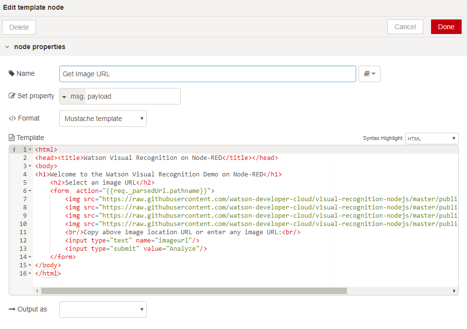
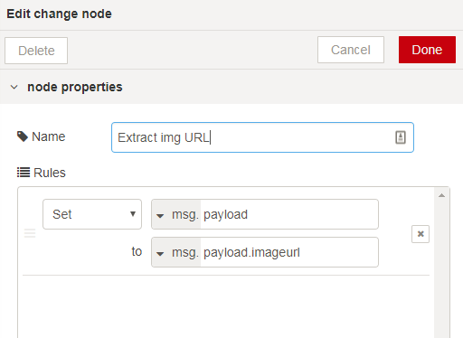
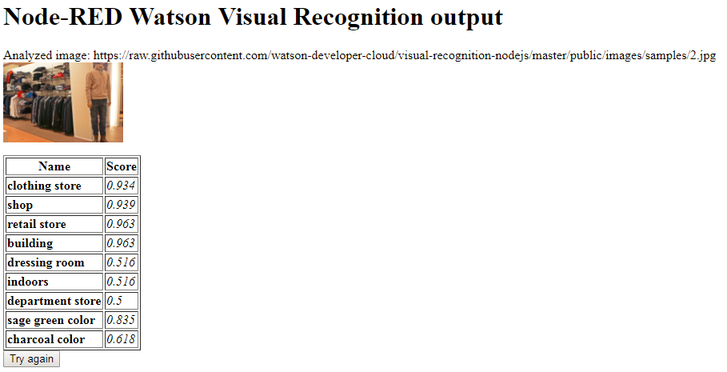

#  Lab: Watson Visual Recognition avec Node-RED

## In troduction

Le service Watson  Visual Recognition  permet d'analyser le contenu d'une image et de produire une série de classificateurs de texte avec un indice de confiance.

## Le noeud Watson Visual Recognition

The Node-RED  node prend une URL d'image ou un flux binaire en entrée et produit un ensemble de mot-clés sur l'image en sortie.

## Construction d'un flux avec Watson Visual Recognition

Dans cet exercice, nous allons vous montrer comment générer simplement les étiquettes à partir d'une URL d'image.

### création du flux

Le flux présentera une simple page Web avec un champ de texte indiquant où entrer l'URL de l'image, puis l'envoie à Watson Visual Recognition. Il produira les étiquettes trouvées sur la page Web de réponse.


Les nœuds requis pour créer ce flux sont les suivants:

 - Un noeud  node, configured with a `/reco` URL
 - Un noeud  node which will test for the presence of the `imageurl` query parameter:
   
 - A first  node, configured to output an HTML input field and suggest a few selected images taken from the main Watson Visual Recognition demo web page:
```HTML
<html>
    <head>
        <title>Watson Visual Recognition on Node-RED</title>
    </head>
    <body>
    <h1>Welcome to the Watson Visual Recognition Demo on Node-RED</h1>
        <h2>Select an image URL</h2>
        <form  action="{{req._parsedUrl.pathname}}">
            
            
            
            
            <br/>Copy above image location URL or enter any image URL:<br/>
            <input type="text" name="imageurl"/>
            <input type="submit" value="Analyze"/>
        </form>
    </body>
</html>
```


- Un noeud  node (named `Extract img URL` here) to extract the `imageurl` query parameter from the web request and assign it to the payload to be provided as input to the Visual Recognition node:


 - Un noeud  . 

 

 - And a final   node linked to the  output node. The template will format the output returned from the Visual Recognition node into an HTML table for easier reading:
```HTML
<html>
    <head><title>Watson Visual Recognition on Node-RED</title></head>
    <body>
        <h1>Node-RED Watson Visual Recognition output</h1>
        <p>Analyzed image: {{payload}}<br/></p>
        <table border='1'>
            <thead><tr><th>Name</th><th>Score</th></tr></thead>
        {{#result.images.0.classifiers.0.classes}}
        <tr><td><b>{{class}}</b></td><td><i>{{score}}</i></td></tr>
        {{/result.images.0.classifiers.0.classes}}
        </table>
        <form  action="{{req._parsedUrl.pathname}}">
            <input type="submit" value="Try again"/>
        </form>
    </body>
</html>
```
  
Note that the HTML snippet above has been simplified and stripped out of non-essential HTML tags, the completed flow solution has a complete HTML page.

### Testing the flow
To run the web page, point your browser to  `/http://xxxx.mybluemix.net/reco` and enter the URL of some  image.
The URL of the pre-selected images can be copied to clipboard and pasted into the text field.

The Watson Visual Recognition API will return an array with the recognized features, which will be formatted in a HTML table by the template:


